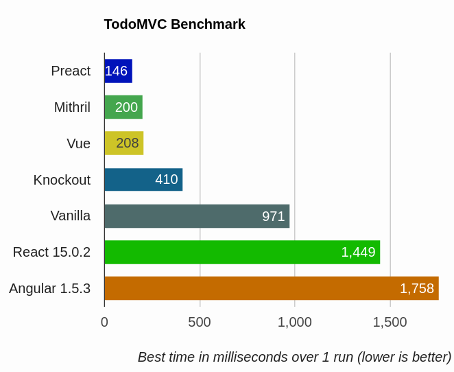

<!-- page_number: true -->

Are Progressive Web Apps the Future of Web Development?
===


---

# What are PWAs
(the developer's version)

* Native-level experience.
* Performance & responsiveness.
* Single codebase.
* Multiple devices, desktop and mobile.

---

# What are PWAs
(the product manager version)

A way to improve the following:
* Conversion rate
* Page visits
* User time spent on app
* Quicker time to market
* Business model freedom
* App discovery
* App installation fatigue
* App loyalty
* App reach

https://cloudfour.com/thinks/the-business-case-for-progressive-web-apps/

---

# Not Everyone Lives in a Wealthy Nation


---

# Apple

(Takes 30% of your sales)  


---

# Show Case 1 - AliExpress


---

# Show Case 2 - Twitter 


---

# Show Case 3 - UBER 


---

# How to Achieve a Native-like Experience?
- Available offline/weak network using Service Worker.
- Measure peformance with the tool Lighthouse.
- Icon on home screen.
- (Android/Mozilla/IE) App-like 'loading' page, no URL, push notification and more.

---

# The PRPL Pattern
https://developers.google.com/web/fundamentals/performance/prpl-pattern/
* Precache
* Render initial route
* Push server
* Lazy-load

---

# Preact

React on steroids - 3k, similar API


---

# Preact - Performance


https://developit.github.io/preact-perf

---

# What does Webpack do for us?
* Creates a single js file from all the JavaScript files.
* Enables a dev server with hot module reloading - https://webpack.github.io/docs/hot-module-replacement-with-webpack.html.
* Dynamic bundle splitting - https://webpack.js.org/guides/code-splitting-async.
* Tree-shaking capabilities - https://webpack.js.org/guides/tree-shaking

---

# What does Babel do for us?

Converts ES2015 syntax to ES5 so my browser will be able to render the JavaScript. Things like import, let, require, arrow function, and also converts jsx to JavaScript.

---

# CSS in Javascript

* https://github.com/css-modules/css-modules
* https://m.alphasights.com/css-evolution-from-css-sass-bem-css-modules-to-styled-components-d4c1da3a659b

---

# CSS Modules

* https://medium.com/@gajus/stop-using-css-in-javascript-for-web-development-fa32fb873dcc

---

# Preact CLI

```bash
npm i -g preact-cli
```

```
preact create app
cd app
preact watch
```

---

# Preact - Baked in PRPL
* **Precache:** The service worker is configured for offline use.
* **Render initial route:** use a tool called prerender.
* **HTTP2/Push Server:** `preact serve` creates a simple HTTP2 server.
* **Lazy-Load:** Automatic code-splitting for routes and shared "chunks" are optimized for reuse. Navigating from `/about` to `/contact` will dynamically (or "lazily") load the "contact" bundle and any associated chunks. This is all thanks to webpack.

---

# Lighthouse


---

# Resources

* How Twitter light was built: https://blog.twitter.com/official/en_us/topics/product/2017/introducing-twitter-lite.html
* How M.UBER was built: https://eng.uber.com/m-uber
* Financial times PWA: https://app.ft.com
* AliExpress PWA: https://m.aliexpress.com
* Preact: https://preactjs.com
* Preact-cli: https://github.com/developit/preact-cli
