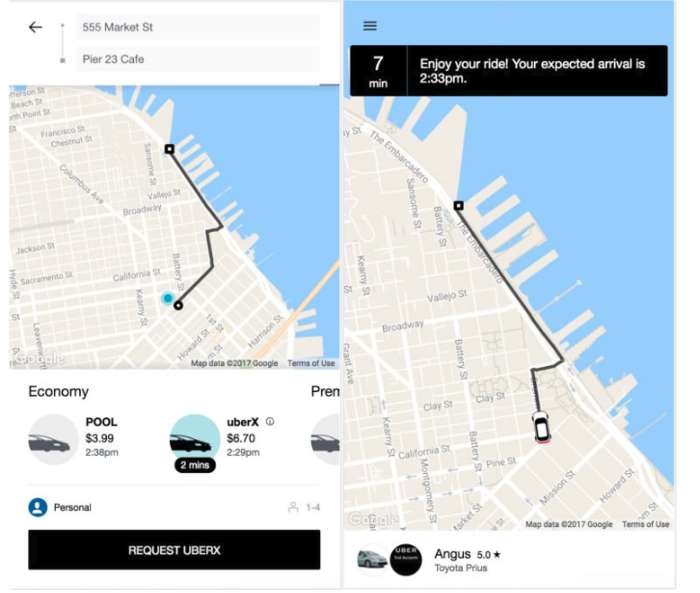

<!-- page_number: true -->

Are Progressive Web Apps the Future of Web Development?
===


---

# Format of this talk

* 5 minutes Ignite style (20 slides, auto-run mode, 15 secs each).
* 30 minutes of mob programming (4 engineers will be working on the app together using github to send PRs).
* 5 minutes for questions.

---

```
return (
  <Profile
    name="Oren Golan">
    job="SDM, Amazon Video"
    location="Seattle"
    website="oren.github.io"
  </Profile>
)
```


---

# What are PWAs
(the developer's version)

Native-level experience that works reliably on both desktop & mobile. Key concepts are performance & responsiveness.

---

# What are PWAs
(the product manager version)

A way to improve the following:
- Conversion rate
- Page visits
- User time spent on app
- Quicker time to market

---

# Show Case 1 - AliExpress


---

# Show Case 2 - Twitter 


---

# Show Case 3 - UBER 


---

# Not Everyone Lives in a Wealthy Nation


---

# How to Achieve a Native-like Experience?
- Available offline/weak network using Service Worker.
- Measure peformance with the tool Lighthouse.
- Icon on home screen.
- (Android/Mozilla/IE) App-like 'loading' page, no URL, push notification and more.

---

# Apple


---

# The PRPL Pattern
https://developers.google.com/web/fundamentals/performance/prpl-pattern/

---

# Preact


---

# Preact - Baked in PRPL
* **Precache:** The service worker is configured for offline use.
* **Render initial route:** prerender
* **Push:** serve (by default) creates a simple HTTP2 server, which is a HTTP2/Push server. You can check the console for verification.
* **Lazy-Load:** Automatic code-splitting for routes and shared "chunks" are optimized for reuse. Navigating from `/about` to `/contact` will dynamically (or "lazily") load the "contact" bundle and any associated chunks. This is all thanks to webpack.

---

# Preact - Performance


https://developit.github.io/preact-perf


---

# Preact - Webpack
* Creates a single js file from all the JavaScript files.
* Lets me use the dev server and it enables the hot module reloading feature.
* Dynamic bundle splitting - https://webpack.js.org/guides/code-splitting-async
* Tree-shaking capabilities - https://webpack.js.org/guides/tree-shaking

---

# Preact - Babel

Converts ES2015 syntax to ES5 so my browser will be able to render the JavaScript. Things like import, let, require, arrow function, and also converts jsx to JavaScript.

---
# Preact - CSS Module
(removes the C from the CSS)

index.js
```
import style from "./style"
<div class={style.rounded}>
```

style.css
``` css
.rounded {
	display: block;
	background: #FFF;
	margin: 0px auto 0 auto;
	border-radius: 8px;
	padding: 10px;
}
```

https://github.com/css-modules/css-modules

---

# Preact CLI

```bash
npm i -g preact-cli
```

```
preact create app
cd app
preact watch
```

---

# Resources

* How Twitter light was built - https://blog.twitter.com/official/en_us/topics/product/2017/introducing-twitter-lite.html

* How M.UBER was built - https://eng.uber.com/m-uber

* Financial times PWA - https://app.ft.com

* AliExpress PWA - https://m.aliexpress.com

* Preact-cli - https://github.com/developit/preact-cli